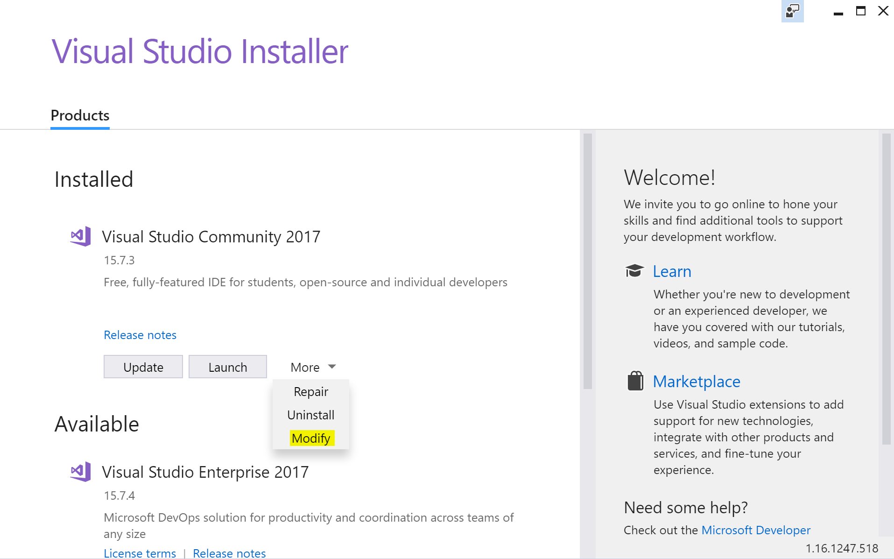

# Lesson 1: Setting Up

## Dependencies
It'll be important you have a few tools installed to get going quickly. Make sure you have the following installed on your local machine.

### Editor
- [VS Code](https://code.visualstudio.com/download)

### Tools
- [App Center CLI](https://www.npmjs.com/package/appcenter-cli)
- [CodePush CLI](https://www.npmjs.com/package/code-push-cli)
- [App Center extension for VS Code](https://github.com/Microsoft/vscode-appcenter)
```
npm i appcenter-cli code-push-cli -g
code --install-extension vsmobile.vscode-appcenter
```

### Windows
- [VS Code](https://code.visualstudio.com/download)
- [Node LTS](https://nodejs.org/en/)
- [git](https://git-scm.com/)
- [yarn](https://yarnpkg.com/en/docs/install#windows-stable)
- C++ Universal Windows Platform tools
- Windows 10 SDKs (10.0.14393.0 and 10.0.17134.0)

For the UWP dependencies, the easiest way to install is via the Visual Studio Installer. Open the Visual Studio Installer and select modify:


Under the Universal Windows Platform Development section, choose the packages listed above:


## Accounts
Log into a [Github](https://github.com) and [App Center](https://appcenter.ms) account of your choosing. We’ll be using these accounts throughout the lessons to store, build and distribute your code. 

> NOTE: If you didn't use your Github account to login to App Center, create a new app and connect to a Github repository in our Build service to make sure your accounts are linked before proceeding.

## _Exit Criteria_
1. All tooling and dependencies are installed.
2. Logged into Github, VSTS and App Center accounts.

